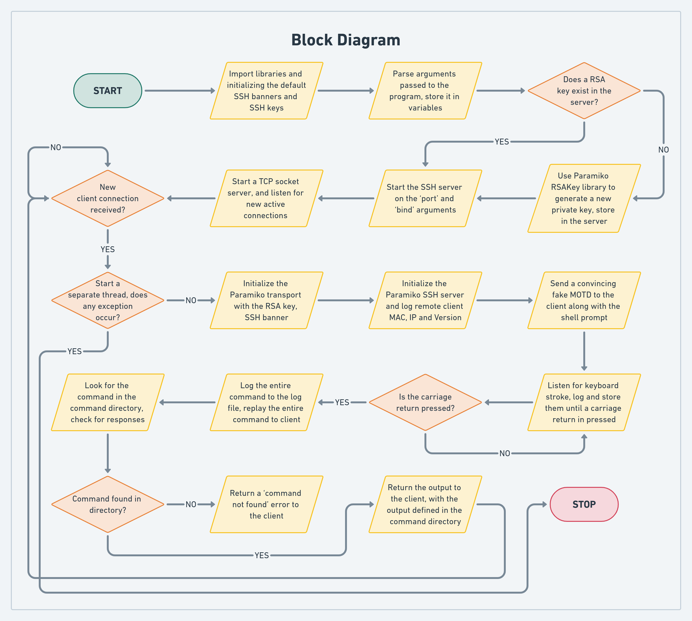
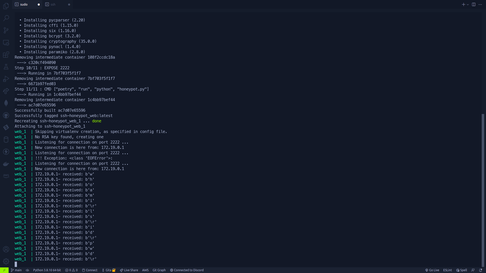
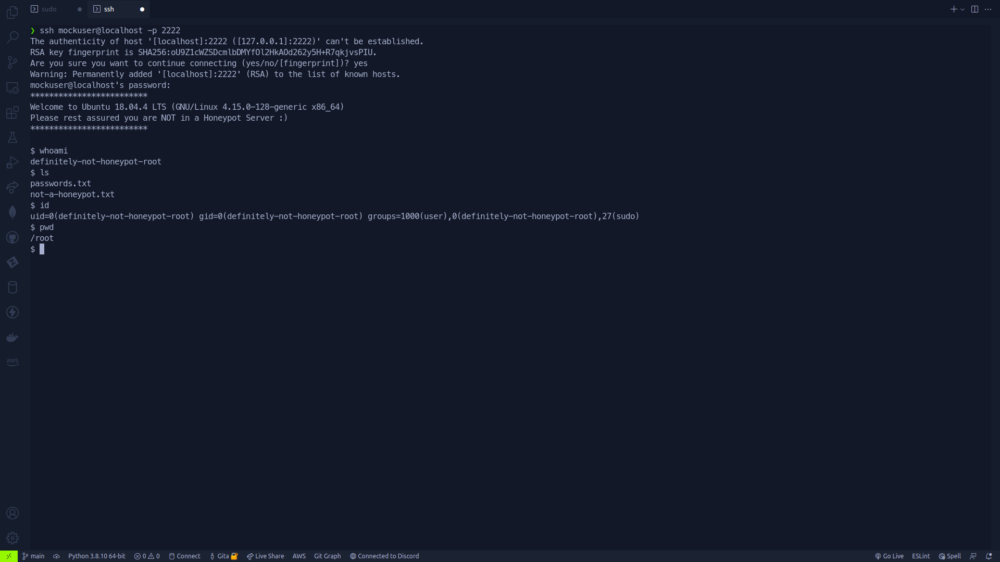
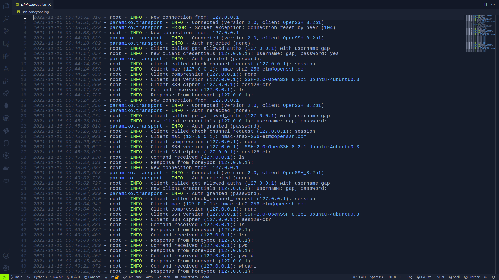
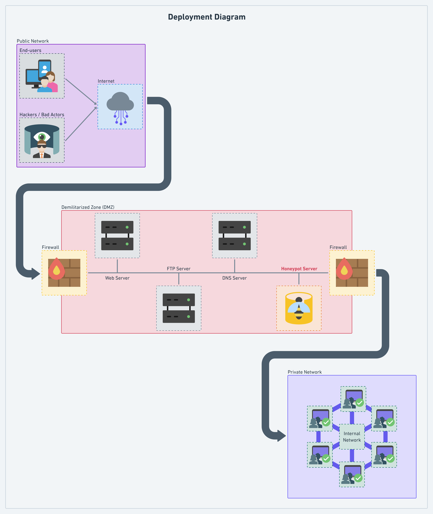

<div align="center"><h1><strong>SSH Honeypot Simulation</strong></h1></div>
<div align="center"><h3><strong>18CSC302J - Computer Networks Mini Project</strong></h3></div>
<br>
<div align="center"></div>

---

## **Team Members**

- **RA1911030010014 - Gita Alekhya Paul**
- **RA1911030010025 - Ratanshi Puri**
- **RA1911030010030 - Nitish Chaturvedi**

## **Abstract**

We have implemented an SSH honeypot in this project, which will act as a proxy server for any central server and used to track the behavior of attacks that are done on any main servers. The function of a honeypot is to represent itself on the internet as a potential target for attackers (usually a server or other high-value asset) and to gather information and notify defenders of any attempts to access the honeypot by unauthorized users.

## **Introduction**

### **How do honeypots work?**

Generally, a honeypot operation consists of a computer, applications, and data that simulate the behavior of a natural system that would be attractive to attackers, such as a financial system, internet of things (IoT) devices, or a public utility or transportation network. It appears as part of a network but is actually isolated and closely monitored. Because there is no reason for legitimate users to access a honeypot, any attempts to communicate with it are considered hostile.
Honeypots may also be put outside the external firewall facing the internet to detect attempts to enter the internal network. The exact placement of the honeypot varies depending on how elaborate it is, the traffic it aims to attract, and how close it is to sensitive resources inside the corporate network. No matter the placement, it will always have some degree of isolation from the production environment. Virtual machines (VMs) are often used to host honeypots. That way, if they are compromised by malware, for example, the honeypot can be quickly restored. Two or more honeypots on a network form a honeynet, while a honey farm is a centralized collection of honeypots and analysis tools.

### **What are honeypots used for?**

- Honeypots are used to capture information from unauthorized intruders that are tricked into accessing them because they appear to be a legitimate part of the network. Security teams deploy these traps as part of their network defense strategy. Honeypots are also used to research the behavior of cyber attackers and the ways they interact with networks.
- Spam traps are also similar to honeypots. They are email addresses or other network functions set up to attract spam web traffic. Spam traps are used in Project Honey Pot, a web-based network of honeypots embedded in website software. Its purpose is to harvest and collect the Internet Protocol (IP) addresses, email addresses, and related information on spammers so web administrators can minimize the amount of spam on their sites. The group's findings are used for research and law enforcement to combat unsolicited bulk mailing offenses.
- Honeypots aren't always used as a security measure. Anyone can use them for network surveillance, including hackers. For instance, a Wi-Fi Pineapple lets users create a Wi-Fi honeypot. Wi-Fi Pineapples are relatively cheap because consumer devices make a fake Wi-Fi network that mimics a real one in the vicinity. Unsuspecting individuals mistakenly connect to the artificial Wi-Fi network, and the honeypot operator can then monitor their traffic.

## **Technology**

### **Technology stack**

- Python (Language of choice)
- Poetry (Package manager)
- Paramiko (SSHv2 implementation in Python)
- Docker (Used for software containerization)

### **Block Diagram**



### **Demo Video**

<div align="center">
  <video width="700" alt="Demo Video" loop src="https://user-images.githubusercontent.com/54375111/141642253-db21b491-25cf-47ff-afa1-3fb655270e99.mp4" autoplay/>
</div>

### **Screenshots**

- **Executing the honeypot server:**

  

- **SSH into the honeypot server:**

  

- **User activity being logged into log file:**

  

## **Installation Instructions**

### **Deployment Diagram**



### **Installing and executing the Honeypot**

The project uses Docker to containerize and package the application for easier deployments. To get started with installing and deploying the application, you might install Docker to refrain from managing the complexities of deployment or deploy it to your system without Docker. We will cover both ways:

- **Installing with Docker:**

  - To get started, install **Docker** to your system through the [**[LINK]**](https://docs.docker.com/engine/install/) on the Docker website.
  - We will use **Docker Compose** on top of Docker to manage our application, you can install Docker Compose from the [**[LINK]**](https://docs.docker.com/compose/install/) on the Docker website.
  - Once installed, head over to the project directory, and type the following commands to start the application (Requires root authentication in UNIX systems):

    ```bash
    sudo docker-compose up --build
    ```

  - Do not close the terminal, keep it open for the SSH server to be up, alteratively you can use the **`-d`** flag to the above command to run the app in 'detached' mode, which means to run it in the background.
  - You can then SSH into the server at **`localhost:2222`** or **`127.0.0.1:2222`** by typing in the following command into a separate terminal (Requires **OpenSSH** installation):

    ```bash
    ssh localhost -p 2222
    ```

  - To view the log file, you will have to SSH into the Docker container, to SSH into the Docker container type the following commands (Requires root authentication in UNIX systems):

    ```bash
    sudo docker exec -it <INSTANCE_ID> bash
    ```

  - To get Docker instance ID, type the following command (Requires root authentication in UNIX systems):

    ```bash
    sudo docker ps
    ```

  - Head over to the **`ssh-honeypot.log`** in the instance project folder, and type the following command to monitor the log file:

    ```bash
    tail -f ssh-honeypot.log
    ```

- **Installing the old-fashioned way:**

  - Install **Poetry**, which is the package manager we use to manage dependencies in the project by visiting this [**[LINK]**](https://python-poetry.org/docs/#installation) on Poetry's website.
  - Once installed, head over to the project root, and type the following commands to install all project dependencies:

    ```bash
    poetry install
    ```

  - To start the server, you can type:

    ```bash
    poetry run python honeypot.py
    ```

  - Do not close the terminal, keep it open for the SSH server to be up.
  - You can then SSH into the server at **`localhost:2222`** or **`127.0.0.1:2222`** by typing in the following command into a separate terminal (Requires **OpenSSH** installation):

    ```bash
    ssh localhost -p 2222
    ```

  - The logs are available in the **`ssh-honeypot.log`** file in the project root.

<div align="center"><h2><strong>Contributors 🤝</strong></h2></div>

<table align="center">
<tr align="center">
<td>

**Gita Alekhya Paul**

<p align="center">

</p>
<p align="center">
<a href = "https://github.com/gitaalekhyapaul"></a>
<a href = "https://www.linkedin.com/in/gitaalekhyapaul/">

</a>
</p>
</td>

<td>

**Ratanshi Puri**

<p align="center">

</p>
<p align="center">
<a href = "https://github.com/Ratanshi"></a>
<a href = "https://www.linkedin.com/in/ratanshi/">

</a>
</p>
</td>

<td>

**Nitish Chaturvedi**

<p align="center">

</p>
<p align="center">
<a href = "https://github.com/waterupto"></a>
<a href = "https://www.linkedin.com/in/waterupto/">

</a>
</p>
</td>

</table>

---
